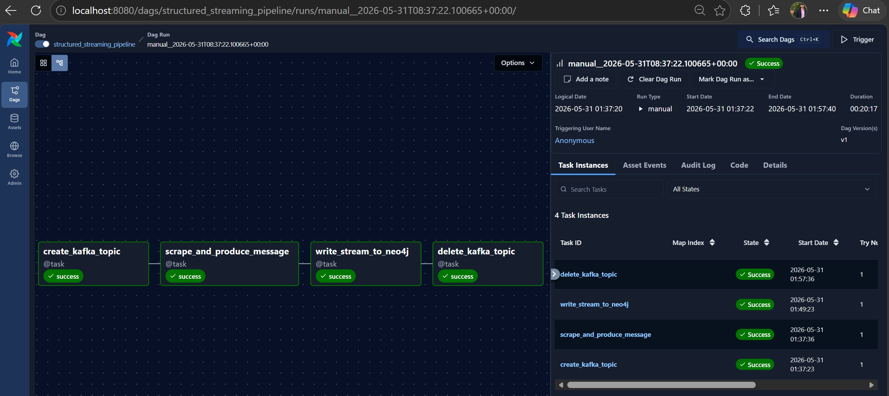
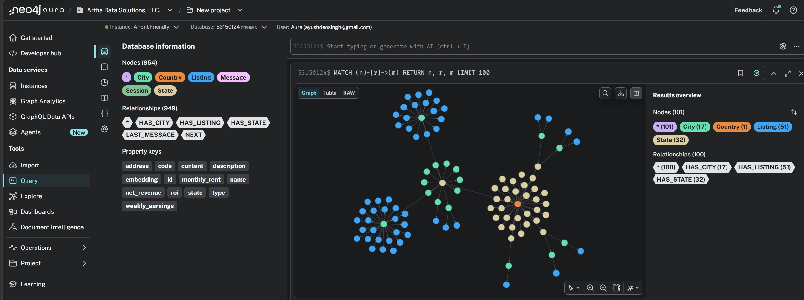
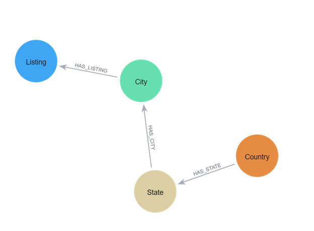
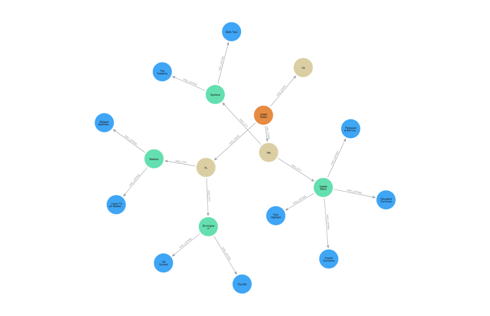

# 2026 Aura Agent Hackathon Submission - HostLens AI

# HostLens AI - A GraphRAG assistant giving real-time market insights on rental investments using Airbnb data

## Agent Name

**HostLens AI**

## What It Does

This agent empowers prospective renters, property managers or even real estate analysts to ask general questions about rental markets, earning potential (ROI & Net Revenue) and investment viability in today's America. It has access to a Neo4j knowledge graph representing current Airbnb-friendly residential listing data across the US, Cypher analytics, semantic similarity vector search, and a Text2Cypher tool equipped with domain-specific info on regional attributes to give informed responses with smart reasoning.

## Motivation

As an Airbnb host myself as well as an avid user of Airbnb when looking for rentals during travel stays, I'm always on the lookout for the best prices. I often monitor market trends in the same area I host my timeshare to give competitive rates to renters, but I also hope to expand my host properties around the country.

My aim was to find a listings site showcasing trends on property listings. It's a good thing that Airbnb has a [page](https://www.airbnb.com/airbnb-friendly) similar to what I was looking for. However, some problems I had included manually searching the listings, as well as not being able to easily get the data in a central forum via a public data API or purchasable dataset.

## Dataset - Bring Your Own Data (BYOD)

To automate the daily extraction of listings from Airbnb's Friendly webpage & write the data model to Neo4j using an optimized schema, the following ETL process was followed:

```bash
   Airflow --> Selenium --> Kafka --> Spark Structured Streaming --> Neo4j
```

This streaming pipeline ensures the knowledge graph always has the most recent information. The data is never stale and accommodates upserts, inserts & deletes!

It is important to note that one can use any data orchestrator of their choice. I used some Big Data technologies to speed up the data processing & also because I have plans to expand this project in the future to a larger scope, but the official [Python-Neo4j](https://pypi.org/project/neo4j/) connector could replace Kafka & Spark Connect here!

Below is a depiction of the Selenium WebDriver in action scraping listing data from a few cities:


In Airflow's Web UI, we can see our DAG with all of its tasks running successfully on a daily basis:



We now have our data loaded into Neo4j. Below is a subset of the graph with all of its nodes, relationships and properties:



As well as the entire schema visualization and an example subgraph:

<table>
  <tr>
    <td></td>
    <td></td>
  </tr>
</table>

[grid]


[/grid]


A summary of the graph database model the above images illustrate:

**Node Structures**

| Node Type | Properties | Description |
|----|----|----|
| **Country** | `name: String` | Represents a country (e.g., "United States") |
| **State** | `code: String` | Represents a state (e.g., "CA", "NY") |
| **City** | `name: String`<br>`state: String` | Represents a city with its state |
| **Listing** | `name: String`<br>`address: String`<br>`monthly_rent: Integer`<br>`weekly_earnings: Integer`<br>`net_revenue: Integer`<br>`roi: Float`<br>`description: String` | Represents an Airbnb listing with financial metrics |

**Relationships**

| Relationship | Direction | From → To | Description |
|----|----|----|----|
| **HAS_STATE** | `→` | Country → State | Country contains states |
| **HAS_CITY** | `→` | State → City | State contains cities |
| **HAS_LISTING** | `→` | City → Listing | City contains listings |

We also can visualize our data by other key metrics and comparisons in a Neo4j dashboard:


## Why a Graph Fits

Sure, it's possible to model this same data in a RDBMS table as disconnected entities. Then the question is what do we lose by doing that, and furthermore what could be gained by structuring relationships across derived properties on the data in a knowledge graph?

The graph model is compelling because it doesn't treat listings as isolated rows. It models listings through geographic containment. It lets the agent traverse from broad geography to specific properties, then aggregate back upward. That is stronger than a flat table because the agent can reason across various levels:

`Listing economics -> City markets -> State trends -> Regional opportunity`

The `ROI` turns rent and earnings into a normalized investment signal, the `Net Revenue` gives a simple monthly profitability estimate, and the `Description` supports semantic search as the vector indexes & constraints allow the agent to retrieve listings/cities by meaning. It supports hierarchical market analysis, region-based aggregation, relationship traversal and agentic tool use.

## Agent Toolset

For the Aura Agent to handle specific types of user requests, we setup 3 types of data retrieval tools to query the graph.


[grid]


[/grid]

### Cypher Template

This type of tool can be used by the agent to answer inquiries with repeatable queries against the graph. Those questions can revolve around:

* Searching for listings by rent, earnings, location, ROI & revenue potential
* Comparing cities, states and regions using graph relationships
* Identifying high-yield opportunities using monthly rent, weekly earnings, ROI & net revenue

Let's portray the Cypher Template tools we have equipped our agent with.

| Tool | Parameters | Description |
|----|----|----|
| Get Listings by City & State | cityName, stateCode | Use when a user asks for listings in a specific city or city and state combination. |
| Get City Market Overview | cityName | Use for comparing markets and understanding local trends. |
| Get Listing Investment Details | listingIdentifier | Use when a user asks for financial details of a specific property. |
| Get Listings by Monthly Rent Range | minRent, maxRent | Use to return all a listings' properties when a rent range is given as input. |
| Get Listings by Weekly Earnings Range | minEarnings, maxEarnings | Use to return all a listings' properties when a weekly earnings range is given as input. |
| Get Listings with Best Earnings Potential | limit | Use to return all a listing's info based off of high weekly earnings & reasonable rent |
| Get Listings with Best ROI | limit | Use to return listings with the best ROI, based off of weekly earnings versus monthly rent ratio. |
| Get Listings with Best Revenue | limit | Use to return all a listing's info with best revenues, based off of weekly earnings minus monthly rent. |

#### Example (Multi-Hop):


[grid]


[/grid]

### Similarity Search

Something to have noted in an above screenshot is that we had an embedding property in the `Listing` node in the graph. While using Structured Streaming to write to our graph, a vector index had been created and afterwards text embeddings using OpenAI. This enables our agent to find listings that match natural-language investment goals.

Secondly, let's also portray the Similarity Search tools we have equipped our agent with.

| Tool | Description |
|----|----|
| Search Listings by Semantic Similarity | Find rental listings based on semantic similarity to a given description or query. This is useful for finding properties matching specific criteria, preferences, or amenities not explicitly modeled in the graph. |

#### Example:


[grid]


[/grid]

### Text2Cypher

Our previous 2 agent tools depend heavily on relationships & properties existing in the graph, but there may be scenarios where we want to give additional yet related context to the agent to answer a question via an ad-hoc query using NLP. This is especially with respect to inquiries regarding regional comparisons, weather-impact analysis, and description pattern recognition across states/regions.

Lastly, let's output a snippet of how we setup this tool with instructions.

| Tool | Description |
|----|----|
| Natural Language to Cypher Tool | Use this ONLY when other tools cannot answer the question. Perfect for regional comparisons, weather-impact analysis, and description pattern recognition across states/regions.<br>WHEN TO USE: Questions requiring analysis of multiple states grouped by region, seasonal patterns, climate impact on listings, geographic trends, or correlation between weather and rental characteristics. |

#### Example:


[grid]


[/grid]

## Reflection

We have now seen how the Aura Agent grounds responses in graph traversals and listing metrics. Previously to implement this type of agent, I would've thought to first create a GraphQL API server with different resolver functions to be used as tools similar to the once just above. Then I would've built a LangChain, Streamlit and MLflow integration to initialize an LLM, create a chat UI and trace & evaluate the LLM, respectively.

With the Aura Agent, I can (to some extent) leverage this managed platform to replace most of that additional overhead & operational complexity. I have been waiting for this type of service for a while & truly see the power it comes with!
